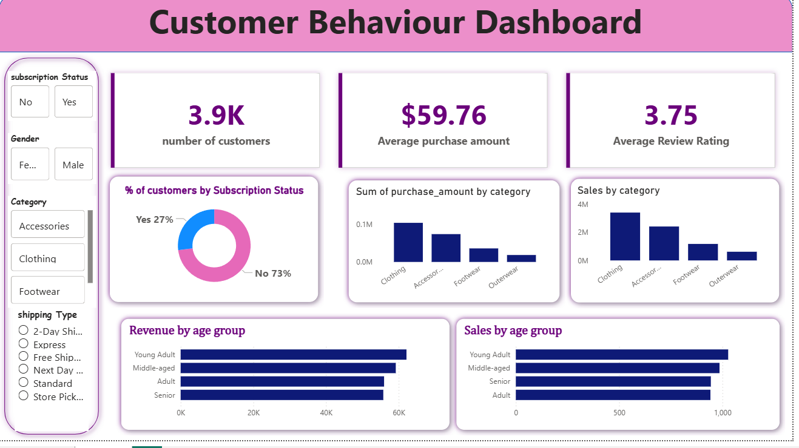

# 📊 Project Title: Customer Behaviour Analysis

## 📌 Objective
Analyze sales data to identify trends, top products, and revenue drivers.

## 📂 Dataset
- Source: Kaggle / Company Data
- Columns: Order ID, Product, Region, Sales, Profit

## 🔧 Tools Used
- Python (Pandas, Matplotlib)
- SQL
- Power BI

## 🧹 Data Cleaning
- Removed null values
- Fixed data types
- Handled duplicates
  
## 📈 Key Insights
- Young Adults generated the highest revenue among all age groups  
- Adults showed the lowest sales count despite being a major segment  
- 73% of customers are non-subscribers, indicating a large untapped market  
- Clothing category contributed the highest sales compared to other categories  

## 💼 Business Recommendations
- Target young adults with personalized offers to maximize revenue  
- Create strategies to increase engagement among adult customers  
- Convert non-subscribers using discounts and loyalty programs  
- Focus marketing on high-performing categories like Clothing

  ## 🚀 Project Impact
This project demonstrates how data-driven insights can improve customer targeting and increase revenue.

## 📸 Dashboard Preview

